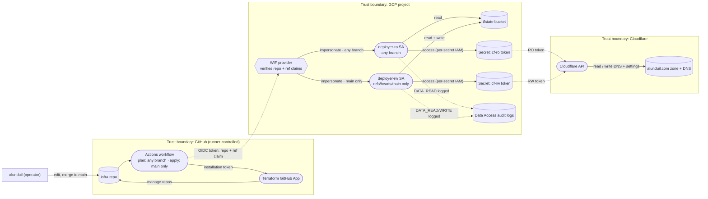

<!-- SPDX-FileCopyrightText: 2026 Alex Brandt <alunduil@gmail.com> -->
<!-- SPDX-License-Identifier: MIT -->
<!-- markdownlint-disable MD013 -->

# Trust model

Data-flow diagram of how a Terraform apply earns the right to change
real infrastructure — the identity and secret path from a commit on
`main` to a DNS write on Cloudflare. Hand-authored Mermaid, not a
Structurizr export: trust boundaries and data flows aren't elements of
the C4 model, so this view shares nothing with `workspace.dsl` and
gains nothing from being generated. Diátaxis classification:
*explanation*.

Dashed edges cross a **trust boundary** — the points where one zone
hands authority to another, and therefore where the controls live.

## Boundary crossings and their controls

Each dashed edge is an attack surface; each is narrowed by one control:

- **Runner → GCP (OIDC federation).** The runner presents a short-lived
  OIDC token. The WIF provider verifies the `repository` claim, and the
  `ref` claim decides which identity it may impersonate: the read-only
  SA from any branch, the read-write SA only from `refs/heads/main`. A
  branch or fork cannot reach the write identity.
- **SA → Secret Manager.** Accessor IAM is granted per secret: the RO SA
  can read only the RO token's secret, the RW SA only the RW token's.
  Compromising the plan identity does not yield the write token.
- **Secret → Cloudflare.** The tokens are themselves scoped — the RO
  token is Zone/DNS/Settings read; the RW token adds DNS and Settings
  write on `alunduil.com` only. The blast radius of either token stops
  at one zone.
- **Every read and write is logged.** Data Access audit logging is on
  for Cloud Storage (read + write) and Secret Manager (read), so state
  access and secret access leave a trail.

## Out of band

The Cloudflare **master token** never enters this flow. It is
operator-only, created before the bootstrap apply to provision the RO
and RW tokens, then revoked. It crosses the operator → Cloudflare
boundary by hand and does not persist in any automated path.
